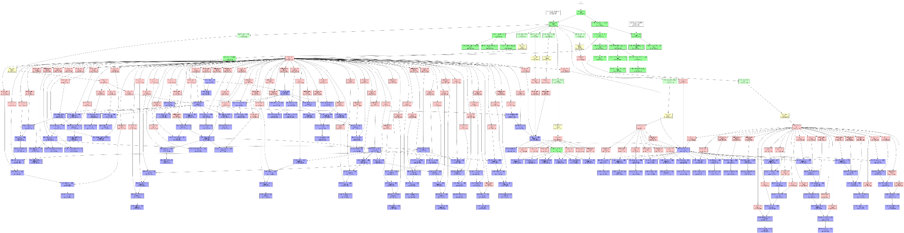
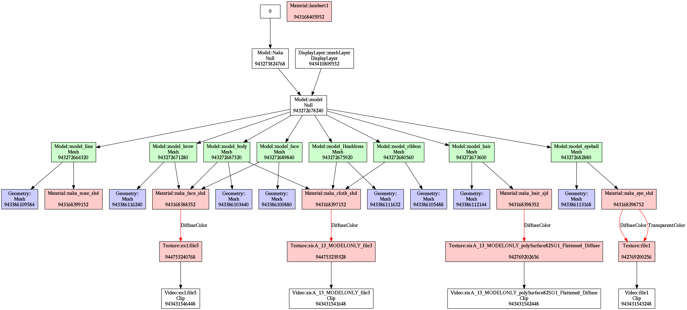

# fbx\_objects\_depviz, FBX objects (nodes) dependency visualizer




## About
This is utility to visualize dependencies of FBX objects.

"Normal" users of FBX won't need this utility, but it may be useful for
implementers of FBX loader library.

## Usage
```
cargo run -- <fbx_file> [--output=<dot_file>] [--filter=<json_file>]
```

This utility loads `fbx_file` and modify styles or visibility of nodes (if
`json_file` is specified), and then puts dot file to `dot_file`.
If `dot_file` is not specified, standard output is used.

About dot files, see
[Graphviz | Graphviz - Graph Visualization Software](http://www.graphviz.org/)
and [the official content](http://www.graphviz.org/content/dot-language).

For sample json files and their outputs, see `examples/` directory.

## Rust version

Latest stable compiler (currently 1.33) is supported.

## License

Licensed under either of

* Apache License, Version 2.0, ([LICENSE-APACHE.txt](LICENSE-APACHE.txt) or
  <http://www.apache.org/licenses/LICENSE-2.0>)
* MIT license ([LICENSE-MIT.txt](LICENSE-MIT.txt) or
  <http://opensource.org/licenses/MIT>)

at your option.

### Contribution

Unless you explicitly state otherwise, any contribution intentionally submitted
for inclusion in the work by you, as defined in the Apache-2.0 license, shall be
dual licensed as above, without any additional terms or conditions.

## Sample outputs
Some of the images below are reduced.
Raw sample outputs are in `examples/` directory.




